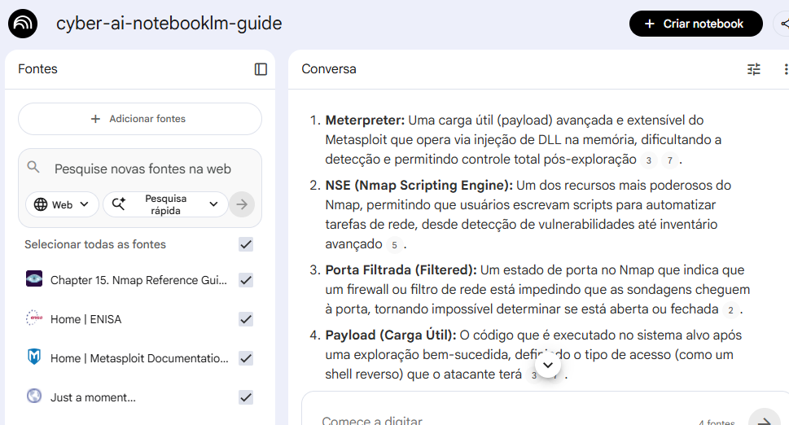

# 🛡️ Cyber AI NotebookLM Guide

Este repositório contém o projeto prático desenvolvido para o Bootcamp de Cybersecurity & AI da **DIO**. O objetivo é demonstrar o uso da Inteligência Artificial (Google NotebookLM) como ferramenta de apoio e curadoria de conhecimento em cenários de **Pentest Assistido por IA**.

---

## 🎯 Contexto e Objetivos
O foco deste estudo é a convergência entre ferramentas clássicas de segurança (**Nmap** e **Metasploit**) e os frameworks de vulnerabilidades (**OWASP**) e governança (**ENISA**). O objetivo é criar um fluxo de trabalho onde a IA auxilia na correlação de falhas e automação de scripts de auditoria.

## 📚 Curadoria de Fontes
As seguintes fontes oficiais foram utilizadas para alimentar o NotebookLM:
* **OWASP Top 10 (2021):** Guia de vulnerabilidades em aplicações web.
* **Nmap Reference Guide:** Documentação oficial para mapeamento de redes.
* **ENISA - AI & Cybersecurity:** Desafios e estratégias de segurança para IA.
* **Metasploit Documentation:** Guia técnico do framework de exploração.

## 🧠 Engenharia de Prompts e "Cicatrizes"
Para extrair o melhor resultado, utilizei a técnica de **Persona** e **Contextualização**:

| Prompt Testado | Resultado Obtido | Ajuste Realizado (Cicatriz) |
| :--- | :--- | :--- |
| "Como usar Nmap e Metasploit?" | Resposta genérica e teórica. | Adicionei a persona de "Analista de Red Team" para obter comandos reais. |
| "Correlacione OWASP com as ferramentas." | Tabela inicial com poucos detalhes. | Solicitei que incluísse capacidades específicas como NSE e Meterpreter. |

---

## 📖 Miniguia de Estudo (Resultado Final)

> Este Miniguia foi elaborado com base nas documentações técnicas para fornecer um roteiro estruturado de auditoria de segurança.

### 1. Correlação: Falhas OWASP vs. Ferramentas (Nmap & Metasploit)

| Categoria OWASP | Capacidades do Nmap | Capacidades do Metasploit |
| :--- | :--- | :--- |
| **Configuração Incorreta** | Identificação de portas, serviços e versões. | Módulos auxiliares para scanners de login. |
| **Injeção (SQL/Command)** | Scripts NSE para detecção básica. | Módulos específicos para exploração de SQLi e CMD. |
| **Componentes Desatualizados** | Detecção de SO e versões via `-A`, `-sV`. | Exploração de CVEs e verificação de patches. |
| **Falhas de Autenticação** | Scripts NSE para enumeração de usuários. | Brute-force (AuthBrute) e ataques SMB/SSH. |
| **Controle de Acesso** | Mapeamento de topologia e filtros de pacotes. | Pós-exploração com **Meterpreter** e escalada. |

### 2. Glossário de Termos Essenciais
* **Meterpreter:** Carga útil (payload) avançada que opera via injeção de DLL na memória, dificultando a detecção.
* **NSE (Nmap Scripting Engine):** Recurso para automatizar tarefas de rede e detecção de vulnerabilidades.
* **Porta Filtrada (Filtered):** Estado que indica que um firewall está impedindo a determinação do status da porta.
* **Payload (Carga Útil):** Código executado no alvo após uma exploração bem-sucedida (ex: Shell Reverso).
* **Vulnerability Disclosure:** Processo de relatar falhas para garantir a correção de produtos de TIC.

---

### 🛠️ Prompts Reutilizáveis para Revisão
1. *"Atue como um Pentester. Com base nos logs do Nmap, sugira 3 módulos do Metasploit para exploração inicial."*
2. *"Gere um checklist de remediação baseado no OWASP para a vulnerabilidade identificada nas fontes."*

---
🚀 Desenvolvido durante o Bootcamp de Cyber Security & AI da DIO.
